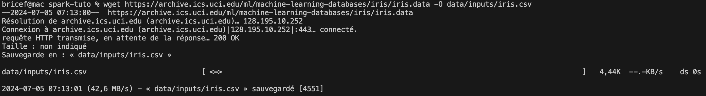
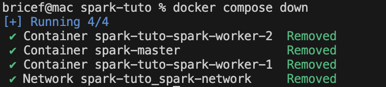

Whether you're developing data applications, testing Spark jobs, or learning Spark, setting up a local cluster with Docker can streamline your development process and reduce overhead. This tutorial will guide you through the steps of creating a local Spark cluster using Docker, enabling you to:

- **Develop and test locally**: Run and test Spark jobs on your local machine without the need for a full-scale cluster, ideal for development and preliminary tests.
- **Simulate production environments**: Configure your local cluster to mirror production settings, ensuring consistency between development and deployment.
- **Learn and experiment**: Provides an accessible way for new learners to set up a functional Spark environment, experiment with its features, and practice development without requiring significant resources or setup.

By using Docker volumes, we'll ensure that your data and configurations persist across restarts, making your local cluster a robust tool for continuous development and testing.
Let's get started and see how Docker can make working with Spark easier and more efficient!


---

## Prerequisites
Before we dive into setting up our local Spark cluster using Docker, ensure you have the following prerequisites :
- **Docker**: you need Docker installed and running on your machine. You can download it from Docker's official site. 
- **Basic knowledge of Docker and Spark**: Familiarity with Docker commands and a basic understanding of Apache Spark will help you follow this tutorial more effectively, even if running the commands will just work.

## Setting Up the Environment

### Creating Docker Network
To enable inter-container communication, we'll set up a Docker network. This network allows the Spark master and worker containers to communicate seamlessly.
Open your terminal and create a new Docker network:
```shell
docker network create spark-network
```

This command creates a network named spark-network that we will use to connect our Spark containers.

### Creating Docker Volumes

Next, we'll create a Docker volume to persist and share our input data between the nodes. 
This volume will ensure that our input data are retained even if the containers are restarted. For the output results, we'll also use volume to save them locally but not the same way as the input data.

Create volumes for Spark input data storage:
```shell
docker volume create spark-inputs
```


## Creating the Spark Cluster

### Setting up the Spark Master

First, we'll start by setting up the Spark master node using a Docker container. This master node will manage the worker nodes and distribute the tasks among them.

### Why use a non-root container?
Non-root container images add an extra layer of security and are generally recommended for production environments. However, because they run as a non-root user, privileged tasks are typically off-limits. 

### Configuration
**Environment variables**
Customizable environment variables


- **SPARK_MODE**: Spark cluster mode to run (can be master or worker).	
- **SPARK_MASTER_URL**: Url where the worker can find the master. Only needed when spark mode is worker.	

**Build our Spark Docker image**

Create a new file named Dockerfile with the following content:
```Dockerfile
# Use the bitnami Spark image as it comes pre-configured with necessary Spark components
FROM bitnami/spark:latest

# Add a user to run the application
RUN useradd -ms /bin/bash spark

# Create directories for data and jobs
RUN mkdir -p /data/inputs /data/outputs /jobs

# Set the ownership of the directories to the spark user
RUN chown -R spark:spark /opt/bitnami/spark /data /jobs

# Set the user to run the application
USER spark
````
We create and set up a new user named spark to run the application to ensure that the container runs as a non-root user. 
> It's a good practice to run containers as non-root users to enhance security and reduce the risk of privilege escalation attacks. For example, if a container is compromised, the attacker will have limited access to the host system. 


Create the Docker image running the following command:
```shell
docker build -t custom-spark .
```


Start the Spark master container and attach the spark-inputs volume for data persistence:

```shell
docker run -d \
  --name spark-master \
  --hostname spark-master \
  --network spark-network \
  -p 8080:8080 \
  -p 7077:7077 \
  -v spark-inputs:/data/inputs \
  -v ./data/outputs:/data/outputs \
  -v ./jobs:/jobs \
  -e SPARK_MODE=master \
  custom-spark 
```
This command runs the Spark master container, mapping the necessary ports and linking it to the spark-inputs volume for data storage.

 Check the status of the container:
```shell
docker ps
```


**About the volumes:**
- `spark-inputs`: Used to store the input data for the Spark jobs. This volume is shared between the master and worker nodes.
- `data/outputs`: Used to store the output results of the Spark jobs. This volume is mounted locally to save the results on your host machine so that you can access them easily.
- `jobs`: Used to store the PySpark scripts that you want to run on the cluster. This volume is mounted locally to allow you to edit and manage the scripts on your host machine.

**About the command:**
```
--name spark-master: Assigns the container the name spark-master.

--hostname spark-master: Sets the hostname of the container to spark-master.
--network spark-network: Connects the container to the spark-network.
-p 8080:8080: Maps port 8080 on the host to port 8080 on the container for the Spark master web UI.
-p 7077:7077: Maps port 7077 on the host to port 7077 on the container for the Spark master service.
-v spark-inputs:/data/inputs:ro: Attaches the spark-inputs volume to the container for data persistence.
-v ./data/outputs:/data/outputs: Attaches the data/outputs directory to the container for output storage.
-v ./jobs:/jobs: Attaches the jobs directory to the container for job storage.
-e SPARK_MODE=master: Bitnami environment variable that define if the node is the master or a worker. Sets the container to run in master mode.
custom-spark: Specifies the custom Spark image to use for the container.
```

### Adding a Spark Worker Node
Once the master is up and running, we can connect worker nodes to it.
Start a Spark worker container:


```shell
docker run -d \
  --name spark-worker-1 \
  --hostname spark-worker-1 \
  --network spark-network \
  -e SPARK_MASTER=spark://spark-master:7077 \
  -e SPARK_MODE=worker \
  -v spark-inputs:/data/inputs \
  -v ./data/outputs:/data/outputs \
  -v ./jobs:/jobs \
  custom-spark 
```
This command runs the Spark worker container, connecting it to the spark-network and attaching spark-inputs volume for input data persistence.

Check the status of the container:

You should see the spark-worker-1 container running alongside the spark-master container.

### Running a Spark Job
**Prepare folder structure**

Create the following directories to store the inputs, outputs, and job scripts:
```shell
mkdir -p ./data/inputs ./data/outputs ./jobs
```
**Script Preparation**

We'll create a simple PySpark script that reads the Iris dataset, performs a basic data manipulation, and writes the results back to the spark-data volume.

Create a new file named `spark_job.py` with the following content:
```python
  from pyspark.sql import SparkSession  
# Initialize Spark session 
spark = SparkSession.builder.appName("IrisDataProcessing").getOrCreate()  

# Read the dataset 
df = spark.read.csv("/data/inputs/iris.csv", inferSchema=True, header=False)  

# Rename columns 
columns = ["sepal_length", "sepal_width", "petal_length", "petal_width", "species"] 

df = df.toDF(*columns)  
# Perform a basic data manipulation: calculate average sepal length by species 

avg_sepal_length = df.groupBy("species").avg("sepal_length")  

# Write the results back to the Docker volume 
avg_sepal_length.write.csv("/data/outputs/avg_sepal_length_by_species")  

# Stop the Spark session 
spark.stop()
```

## Getting data
Let's download the Iris dataset  from the UCI Machine Learning Repository or any other source you prefer.

```shell
wget https://archive.ics.uci.edu/ml/machine-learning-databases/iris/iris.data -O data/inputs/iris.csv
```


## Copy data and script to the cluster 

- **Input data**: Copy the Iris dataset to the Spark master container.
```shell
docker cp data/inputs/iris.csv spark-master:/data/inputs/iris.csv
```
That's the output you should see:


- **PySpark script**: we don't need to copy the script to the master container, we can just move it to the jobs folder that is already mounted to the master container.
```shell
cp spark_job.py .jobs/spark_job.py
```

Verifying Data Accessibility
To verify that the data is accessible, you can start an interactive session within the Spark master container:
```shell
docker exec -it spark-master ls /data/inputs /jobs
```
Inside the container, list the contents of the `/data/inputs` and `/jobs` directory to ensure the dataset is present.

You should see this output:


### Job Execution
Execute the script using the Spark master container:
```shell
docker exec -it spark-master spark-submit \
  --master spark://spark-master:7077 \
  --deploy-mode client /jobs/spark_job.py
```
This command runs the PySpark script on the Spark cluster, reading the dataset from the volume, processing it, and writing the results back to the volume.

The output should look like this:


Once the job is finished, you can check the results:
```shell
docker exec -it spark-master ls /data/outputs/avg_sepal_length_by_species
```
You should see the output files in the avg_sepal_length_by_species directory.


The output files contains the results of the Spark job, showing the average sepal length by species.
You can display the contents of the output files to view the results:
```shell
docker exec -it spark-master cat /data/outputs/avg_sepal_length_by_species/part-00000-9b270837-872e-4a34-bb5b-4cb6d52044be-c000.csv
```
> Warning: The output file name may vary depending on the Spark job execution. Replace part-00000-9b270837-872e-4a34-bb5b-4cb6d52044be-c000.csv with the actual file name in your output directory.

### More Worker Nodes
You can add more worker nodes to the cluster by running additional containers and connecting them to the Spark master node. 
For this, let's use a script to automate the process of adding worker nodes to the cluster specifying the number of nodes to add.
```shell
#!/bin/bash

# Number of worker nodes to add
NUM_WORKERS=$1

# Start the worker nodes
for i in $(seq 1 $NUM_WORKERS)
do
  docker run -d \
    --name spark-worker-$i \
    --hostname spark-worker-$i \
    --network spark-network \
    -e SPARK_MASTER=spark://spark-master:7077 \
    -e SPARK_MODE=worker \
    -v spark-inputs:/data/inputs \
    -v ./data/outputs:/data/outputs \
    -v ./jobs:/jobs \
    custom-spark
done
```
Save the script as add_workers.sh and make it executable:
```shell
chmod +x add_workers.sh
```
Run the script to add additional worker nodes to the cluster:
```shell
./add_workers.sh 2
```
This command adds two worker nodes to the cluster, connecting them to the Spark master node.

### Tips and Tricks
- Alias the spark-submit command: To simplify running Spark jobs, you can create an alias for the spark-submit command. For example, you can add the following line to your .bashrc or .bash_profile file:
```shell
alias spark-submit='docker exec -it spark-master spark-submit --master spark://spark-master:7077 --deploy-mode client'
```

With your cluster up and running, if you run the command:
```shell
spark-submit /jobs/spark_job.py
```
It will execute the Spark job on the cluster without needing to specify the master URL each time.

### Cleaning Up
To stop and remove the containers, you can use the following commands:
```shell
docker stop spark-master spark-worker-1 spark-worker-2
docker rm spark-master spark-worker-1 spark-worker-2
```
To remove the Docker network and volumes, you can use the following commands:
```shell
docker network rm spark-network
docker volume rm spark-inputs
```

All of this is working fine, but it's not the best way to scale up your cluster. I will share with you a better way to do this using docker-compose.  

This way is pretty manual and not the best way to scale up your cluster. For local development you have a better option that is using docker-compose.

### Using Docker-Compose

Docker Compose is a tool for defining and running multi-container Docker applications. It uses a YAML file to configure the application's services, networks, and volumes, making it easier to manage and scale your application.

Create a new file named docker-compose.yml with the following content:
```yaml
services:
  spark-master:
    image: custom-spark
    container_name: spark-master
    hostname: spark-master
    networks:
      - spark-network
    ports:
      - "8080:8080"
      - "7077:7077"
    volumes:
      - spark-inputs:/data/inputs
      - ./data/outputs:/data/outputs
      - ./jobs:/jobs
    environment:
      - SPARK_MODE=master

  spark-worker:
    image: custom-spark
    hostname: spark-worker
    networks:
      - spark-network
    environment:
      - SPARK_MASTER=spark://spark-master:7077
      - SPARK_MODE=worker
    volumes:
      - spark-inputs:/data/inputs
      - ./data/outputs:/data/outputs
      - ./jobs:/jobs  

networks:
  spark-network:
    driver: bridge

volumes:
  spark-inputs:
```
This configuration file defines two services: spark-master and spark-worker, each running the custom-spark image. The spark-master service runs in master mode, while the spark-worker service runs in worker mode and connects to the spark-master service.

To start the Spark cluster using Docker Compose, run the following command:
```shell
docker-compose up -d
```
This command starts the Spark cluster using the configuration defined in the docker-compose.yml file.

To start only the master, you can use the command:
```shell
docker-compose up -d spark-master
```

To start only the workers, the number of workers you want to start, you can use the command:
```shell
docker-compose up -d --scale spark-worker=2
```
This command starts two worker nodes in the Spark cluster.


After starting your cluster like this, it works the same way as before, and you can run your Spark jobs as usual.
To run any new spark job, I just have to:
- Add the script to my local jobs folder: `./jobs`
- Copy the input data if needed into the spark-inputs volume: 

  ```
  docker cp data/inputs/new_data.csv spark-master:/data/inputs/new_data.csv
  ```

- Run the job using the spark-submit command(aliased):

```shell
spark-submit /jobs/new_job.py
```

### Stopping the Cluster
To stop the Spark cluster, you can use the following commands:
```shell
docker-compose down
```

### Conclusion
Setting up a local Spark cluster using Docker can streamline your development process, enabling you to test Spark jobs, simulate production environments, and experiment with Spark features in a controlled environment. By using Docker volumes, you can ensure that your data and configurations persist across restarts, making your local cluster a robust tool for continuous development and testing.
